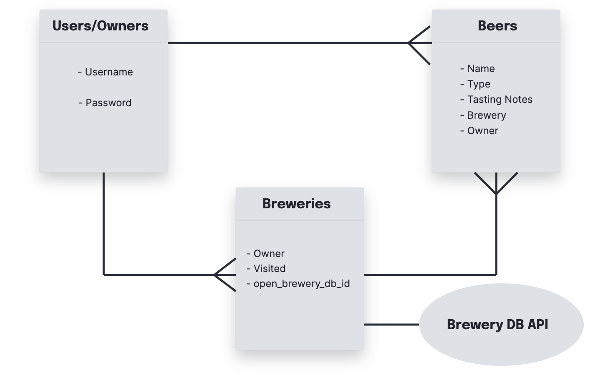

# brewery-lager
**Description:**
An Express Based App that Leverages Mongoose and OpenBrewery API to Look Up and Log a User's Brewery Visits and Beers Tasted

&nbsp;


# Software Resources

## Back-End
 - Database (MongoDB)
     - Mongoose

 - Web Framework (JavaScript)
     - Express
         - NPM Packages
             - bcrypt
             - connect-mongo
             - dotenv
             - express-session
             - liquid-express-views
             - method-override
             - mongoose
             - morgan

## Front-End
 - Liquid
 - Bootsrap
 - Liquid

 &nbsp;

 # External Resources (APIs)
 - [openbrewerydb](https://www.openbrewerydb.org/documentation/01-listbreweries)
  
 &nbsp;
# User Story

## Minimum Viable Product (MVP)

 - Create a username and password
 - Search Breweries by:
     - Name
     - Postal Code
     - City
     - State
     - Type

 - Add Breweries to Bucket List
 - Remove Brewery from Bucket List
 - View a Brewery's details 
 - Edit a Brewery on Bucket List
 - Add Beers with tasting notes to Brewery
 - View a Beer's details

## Stretch Goals

- View all Beers
    - Create Beers without Brewery Visit 

 - Add statistics on breweries
     - Top Rated Breweries
     - Most Frequented Breweries
     - Most Commont Beer-Type Tasted

&nbsp;

 - Add Sorting to the List Views of Breweries and Beers
     - Sort by City Alphabetical Order
     - Sort by Beer Type

 &nbsp;

# Dependencies for local computer

 - npm (Node Package Manager) & Node.js
     - [Downloading and Installing Node.js and npm](https://docs.npmjs.com/downloading-and-installing-node-js-and-npm)
    
 &nbsp;

# Installation 

1. **Fork and Clone** this repo to your local computer
    - **Prerequisites to Fork & Clone**
        - [git](https://docs.github.com/en/articles/set-up-git)
        - [Authentication to github.com from Git](https://docs.github.com/en/get-started/quickstart/set-up-git#next-steps-authenticating-with-github-from-git)
    - [How to fork and clone](https://docs.github.com/en/get-started/quickstart/fork-a-repo#forking-a-repository)


2. **Run the following command** (from the command line by moving into the cloned repo's main/root project directory)
    
    
            touch .env .gitignore

3. **Install Dependencies**
    - From the project's main/root directory run the folling command in the command line
        
                npm install

4. **Add environment variables**
    - to run locally add the following to `.env` 

        ```
        PORT=3000

        MONGODB_URI=mongodb://localhost/brewerylage

        OPENBREWERYDBAPI=https://api.openbrewerydb.org/breweries

        SECRET={any string to use as a secret}
        ```
    &nbsp;

5. **Add the following to `.gitignore`**
    - to avoid adding unecessary package modules and local environment variables add the following:
         ```
        .env
        node_modules
        ```
        
6. **Install Dependencies**
 - Type the following command in the project's main/root directory
    ```
    npm install
    ```

7. **Ensure that everything is working by running the following command**
    ```
    npm start
    ```
    - [CLICK HERE TO OPEN APP LOCALLY IN BROWSER](http://localhost:3000/) 

# Structure

 - Dependencies are stored in [`package.json`](package.json).

 - The most important file for understanding the structure of the template is
`server.js`. This is where the actual Express `app` object is created, where
the routes are registered, and more.

 - The main directory contains models, views, and controller files. Models are simply Mongoose

 - The `models/connection.js` file holds all mongoose connection setup steps and can be required and destructured from just like this (Schema and model given as examples):

    ```js
    const { Schema, model } = require('./connection.js')
    ```
# Tasks

This template uses `npm` as a task runner. 
These are the commands available:

| Command            | Effect                                                                                               |
|----------------------------------------------------------------------|--------------------------------------|
| `npm start`       | Starts a  server with `node` 
| `npm run dev`       |  Starts development environment uses [nodemon](https://www.npmjs.com/package/nodemon)  - (tool that automatically restarts the application when file changes in the directory are detected) by running the following command. Run the following command to install nodemon: `npm install nodemon`|

# Database Entity Relationships



&nbsp;

# Authentication

| Verb   | URI Pattern            | Controller#Action |
|--------|------------------------|-------------------|
| POST   | `/auth/signup`             | `users#signup`    |
| POST   | `/auth/login`             | `users#login`    |
| DELETE | `/auth/logout/`        | `users#logout`   |


# Routing

## Brewery
| Verb   | URI Pattern            | Controller#Action | Description
|--------|------------------------|-------------------|-------|
| GET   | `/brewery/bucketlist`| `INDEX`|`shows a user's breweries not visited`    |
| GET   | `/brewery/visitedlist` | `INDEX`| `shows a user's breweries not visited`    |
| GET | `/brewery/search` |`SEARCH FORM` | `Seach form for brewery lookup with input forms to add to bucketlist or visitedlist index`|
| POST | `/brewery/searchResults` | `FETCH` | `Fetches breweries from API and Displays Results` | 
| POST | `/brewery/addBreweryToList` | `CREATE/NEW` | `Adds/Creates a Brewery object and returns to search results` | 
| PUT | `/brewery/:id` | `EDIT/UPDATE` | `Edits/Updates brewery visit boolean` | 
| GET | `/brewery/:id` | `SHOW` | `Shows brewery info and table of corresponding beers` | 
| DELETE | `/brewery/:id` | `DELETE` | `Deletes Brewery Record` | 

 &nbsp;

## Beer
| Verb   | URI Pattern            | Controller#Action | Description
|--------|------------------------|-------------------|-------|
| GET   | `/beer/index`| `INDEX`|`shows a user's beer records`    |
| GET   | `/beer/:breweryid/create` | `NEW/CREATE FORM`| `renders the form needed to submit a new beer tasting`    |
| POST | `/beer/create` |`NEW/CREATE` | `Creates a beer record`|
| GET | `/beer/:id/edit` | `EDIT/UPDATE FORM` | `Form to submit edits to a beer tasting record` | 
| POST | `/beer/create` | `CREATE/NEW` | `Adds/Creates a beer` | 
| GET | `/beer/:id/edit` | `EDIT/UPDATE FORM` | `Renders form needed to submit edits to a beer ` | 
| PUT | `/brewery/:id` | `EDIT/UPDATE` | `updates details about beer` | 
| GET | `/brewery/:id` | `SHOW` | `Shows beer record`  |
| DELETE | `/brewery/:id` | `DELETE` | `Delete beer record`  |


### Error Handling

Errors are handled with a default view, and should be called as seen in this example:
```js
router.delete('/:id', (req, res) => {
	const exampleId = req.params.id
	Example.findByIdAndRemove(exampleId)
		.then(example => {
			res.redirect('/examples')
		})
		.catch(error => {
			res.redirect(`/error?error=${error}`)
		})
})
```

## [License](LICENSE)

1. All content is licensed under a CC­BY­NC­SA 4.0 license.
1. All software code is licensed under GNU GPLv3. For commercial use or
    alternative licensing, please contact legal@ga.co.


